# The Cost of Private Computation:

# Homomorphic Encryption for Low SWaP

# Platforms

Daniel Achee

Jennifer Quintana

2020.03.20

EE209AS Embedded Systems Cybersecurity

_This project explores the landscape of private, secure data analytics. If a user wants to analyze data
produced by an IoT device without giving away that data to an untrusted third party, they have several
options. One is to perform the analysis locally, which may be impractical given the resource constraints
of their IoT device. An alternative is that they can encrypt the data with homomorphic encryption, send it
to another more powerful device which can perform the analysis directly on the encrypted data, and
receive the results, only decrypted on their local device. We investigated the cost of private computation
on a low SWaP device, a series of AWS EC2 cloud computing instances, and a client-server model
incorporating a resource-constrained platform and a more high-performance platform._

## 1.0 Introduction & History

Homomorphic encryption is an encryption scheme that allows the processing of data in its encrypted
form without requiring access to the key to decrypt. To preserve privacy during data processing on a
remote server, homomorphic encryption allows for data operations directly [1]. The first fully
homomorphic encryption scheme was proposed in 2009 by Craig Gentry in a collaboration between
Stanford University and IBM Watson [2]. As cloud computing and constellation-style communication
hardware, such as the SpaceX Starlink small satellite constellations, become more available, the need for
secure communication and processing among nodes becomes increasingly important. Processing
capabilities on small size, weight, and power (SWaP) devices have made advancements, especially in the
system on a chip (SoC) and field programmable gate array (FPGA) technical development areas. This
means more resources are available on an end device for processing purposes and therefore enhances
the ability to enact more sophisticated security and privacy measures among end devices and remote
computing services. Homomorphic encryption is one of the emerging tools to aid in the enhancement of
privacy features in computing and secure communications.

## 2.0 Homomorphic Encryption Basics

Homomorphic encryption provides secure data processing directly on the cipher text, whose
computation results are also encrypted. The resulting data analysis provides results which match the
equivalent analysis performed on the plaintext data [3] and the structure of the homomorphic data is
preserved [4]. A variety of partially and fully homomorphic encryption schemes are available for
research and analysis. Fully homomorphic encryption (FHE) schemes allow for evaluation of arbitrarily
complex programs on encrypted data [5], whereas partially homomorphic encryption (PHE) schemes are
homomorphic with respect to only one type of data operation, such as addition or multiplication. PHE is
more computationally efficient than FHE, but trades some security for that efficiency [1].

Various implementations of homomorphic algorithms have been developed using public asymmetric key
systems such as RSA, ElGamal, Paillier algorithms [1]. Some of these different encryption schemes that
employ public asymmetric key systems include Brakerski-Gentry-Vaikuntanathan (BGV), Brakerski-Fan-
Vaikuntanathan (BFV), Enhanced Homomorphic Cryptosystem (EHC), Algebra Homomorphic Encryption
(ElGamal-based) (AHEE), and Non-interactive Exponential Homomorphic Encryption Scheme (NEHE) [1].

### 2.1 Types of Homomorphic Encryption

BGV and BFV are asymmetric encryption schemes to encrypt a data stream bit-wise. They use lattice-
based cryptography, which has shown some resistance to quantum computing used for forced data
decryption [6]. BGV employs ring learning with errors (RLWE), which is difficult to solve even for
quantum computers [6]. These schemes are fully homomorphic and have two subprocesses – one
dealing with integer vectors linked to the decisional LWE and one dealing with integer polynomials
linked to RLWE [7]. The polynomial version of the BGV and BFV encryption schemes are more
computationally efficient and more widely explored in terms of applied research systems using FHE [7].

In 2016, Cheon-Kim-Kim-Song developed the CKKS fully homomorphic encryption scheme. CKKS
supports approximate arithmetics over complex numbers and exploits ring isomorphism, which is a
different implementation strategy than BFV. The CKKS encryption scheme consists of encryption,
decryption, addition and multiplication, and rescaling [4]. The security of CKKS encryption, like BFV, is
based on the hardness assumption of RLWE, so the fundamental security properties are similar for both
BFV and CKKS [7].

### 2.2 Encryption Libraries

Two widely used homomorphic encryption libraries for research are the Simple Encrypted Arithmetic
Library (SEAL), developed with Microsoft Research and MIT, and the Homomorphic Encryption Library
(HElib), developed by IBM. Both libraries are available for use on Github. Both libraries are implemented
in C/C++ without external dependencies [8].

HElib is developed based on the BFV polynomial encryption scheme. BFV in this implementation
contains arrays of polynomials, at least two polynomials per array. These grow in size with each
multiplication operation until a relinearization is performed [8]. In the implementation, homomorphic
encryption additions are generated by computing a component-wise sum of these arrays [8].

SEAL supports both BFV and CKKS implementation methods. The SEAL implementation of BFV differs
from the standard BFV mathematical approach because the ciphertexts are described by a tuple
representation – a coordinate representation – of the polynomial [8]. SEAL’s support for CKKS is also
implemented, and the example functions are provided to support both homomorphic encryption
methods. Their results are compared in our analysis.

## 3.0 Experiment Technical Approach

### 3.1 Experiment Goals

Our investigation of the implementation of homomorphic encryption for low-SWaP devices had three
main goals:

1. Analyze and implement the SEAL homomorphic encryption library on a series of low-SWaP
    devices, including processor-only solutions, FPGA-only solutions, and hybrid SoC solutions.
2. Implement the SEAL homomorphic encryption library on a series of Amazon WebService
    Enhanced Cloud Computing (AWS EC2) services to benchmark functional performance and
    memory requirements.
3. Implement a client-server model using a homomorphic encryption scheme between a low-SWaP
    device and a cloud computing service instantiation.

The team had some experience with low-SWaP devices for space applications and wanted to explore the
feasibility of homomorphic implementation in as small a platform as we could reasonably accomplish.
We investigated a series of embedded devices, listed in Table 1.

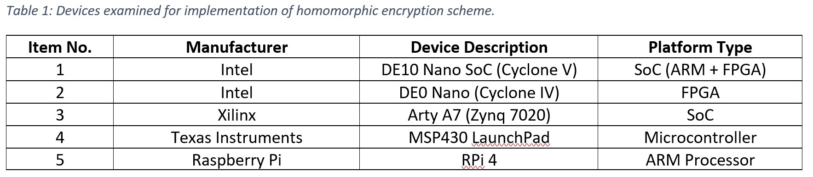

These platforms were selected as being low-SWaP options, defined as small enough and low power
enough to fit on a 1U cubesat, which is 10cm x 10cm x 11cm. Other SoCs, such as the Cyclone 10 or
Stratix 10 Intel boards were examined but determined as too large and had a power consumption
greater than 5- 1 0W. They were also prohibitively expensive for the purpose of this project, each board
on the order of $10,000.

For the Amazon Webservices Elastic Cloud Computing goal, we implemented the SEAL libraries on the
following instances, described in Table 2.

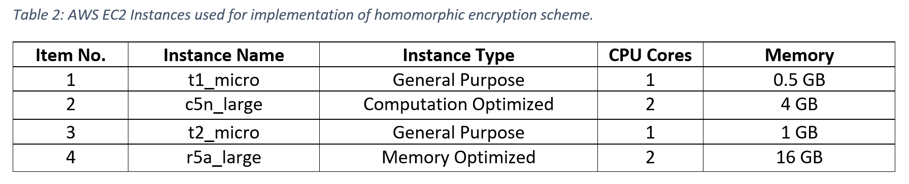

These instances were selected to represent a mix of resource-constrained and high-performance
platforms. The t1_micro instance was examined and later disregarded because it did not have the
computing power to run the polynomial degrees of interest. The t2_instance represents the resource-

constrained platform, whereas the c5n_large and r5a_large instances represent high-performance
computation and memory optimized platforms, respectively.

These instances were also used to benchmark our client-server model, for the third project goal. For a
client-server model, one can theoretically separate the computational requirements, to allow for a small
SWaP platform to use a homomorphic encryption scheme for enhanced privacy and security. We
benchmarked our client-server implementation using the modified SEAL libraries against the baseline
data collected during the implementation of the AWS EC2 instances, with all computation running on a
single platform instance. The implementation and results are discussed in the next section.

### 3. 2 Experiment Implementation

#### 3.2.1 Low SWaP Platform Implementation

After examining potential low SWaP platforms, we first selected the DE10 Nano SoC, a development kit
with a hybrid ARM processor and FPGA Cyclone V chip, manufactured by Intel, shown in Figure 1.

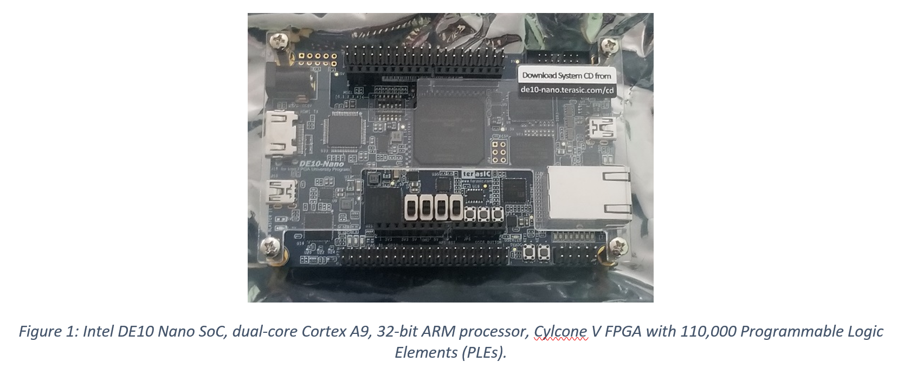

The link to the product page is in 7 .0 Appendix A: Product & Application Links. We used a Yocto Poky
Linux OS booted from a 32GB μSD card slot on the board. The development board also had 1GB DDR
memory accessible by the processor and FPGA fabric. Our interface to the board was Ethernet. A top
level functional block diagram is shown in Figure 2.

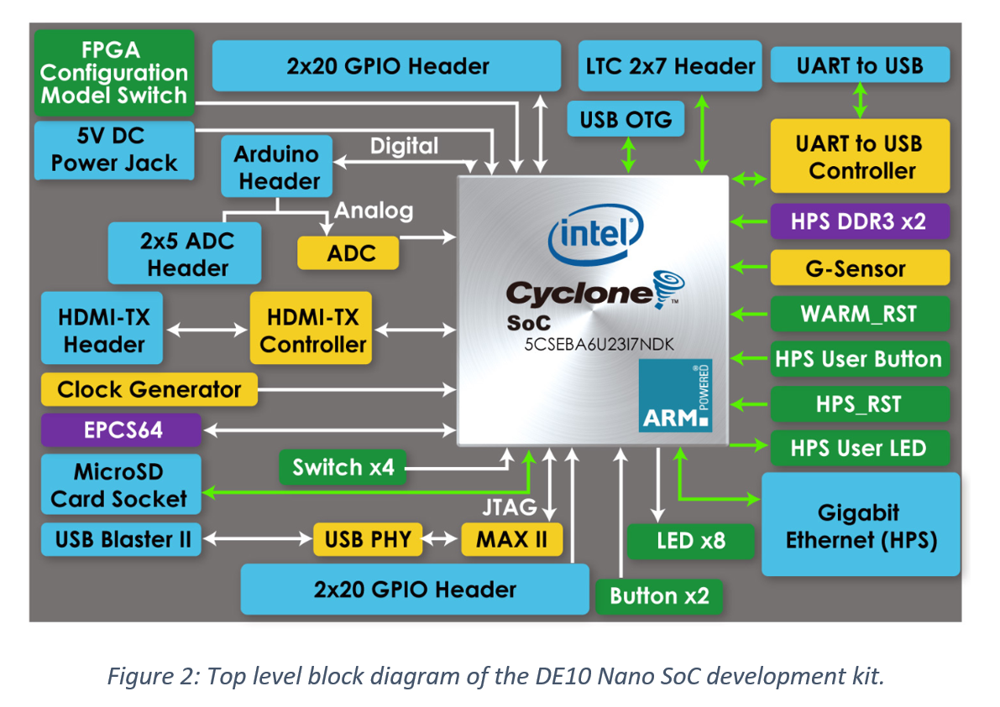

We first attempted to instantiate the SEAL libraries using the Linux kernel running on the ARM Cortex A
processor. However, we quickly learned that many of the SEAL library functions are not compatible with
a 32 - bit instruction set, so our processor was unable to compile and run any meaningful data. We then
attempted to port the C-based SEAL library to HDL using the MATLAB and Simulink DSP and embedded
processing toolboxes. This instantiation exceeded the PLE capacity of the FPGA gate fabric, so we
determined that this first processor selection, chosen for its known usage by the European Space Agency
for LEO orbits and US cubesats and small space payload platforms, was insufficient for homomorphic
encryption schemes. For reference, both the SEAL and HElib libraries require 64-bit processor
capabilities.

We switched then to an alternate, a Raspberry Pi 4, with the 4GB RAM option. The board used for this
experiment is shown in Figure 3.

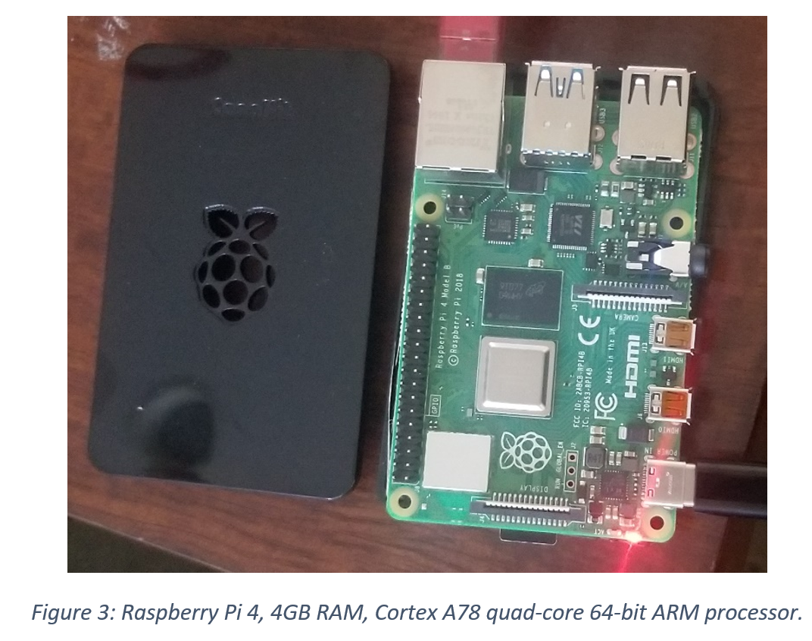

The Raspberry Pi 4 with 4GB RAM has a 64-bit ARM Cortex A78 quad core 64-bit processor, which was
determined to be sufficient for running the majority of functions of the SEAL libraries. A top level
diagram of the Raspberry Pi 4 development kit is shown in Figure 4.

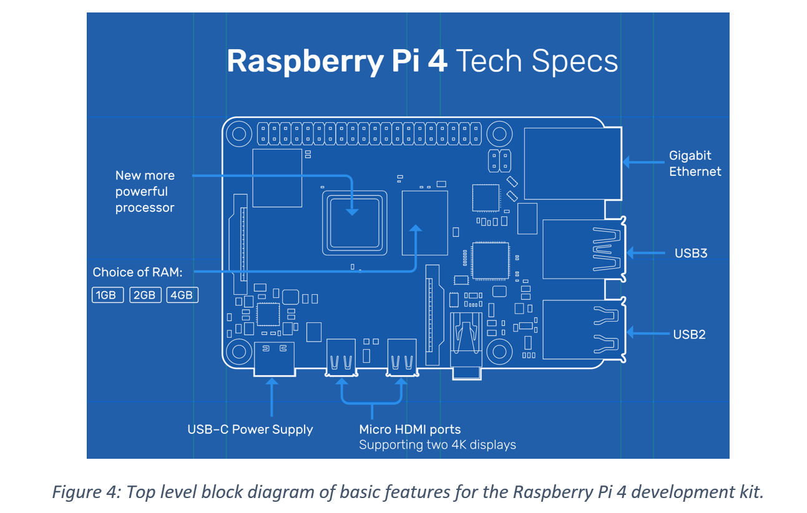

The OS was loaded onto a μSD card, using a modified Raspbian image provided at the link in 7.
Appendix A: Product & Application Links. We opened an SSH terminal using PuTTY to communicate with
the Raspberry Pi.

The SEAL library functions were run on the Raspberry Pi 4 successfully, with data presented in 4.1 Low
SWaP Results. Full functionality for the homomorphic encryption functions, including key generation,
encryption, addition and multiplication functions on the ciphertext, and decryption, were successfully
performed on the Raspberry Pi 4 for polynomial degrees up to and including a polynomial degree of
163 84.

#### 3.2.2 Amazon Webservices Elastic Cloud Computing Implementation

For objective 2, we implemented a series of AWC EC2 instances to compare a general purpose,
computation optimized and memory optimized high-performance computing options for hosting
homomorphic encryption schemes. A view of the AWS EC2 dashboard is shown in Figure 5.

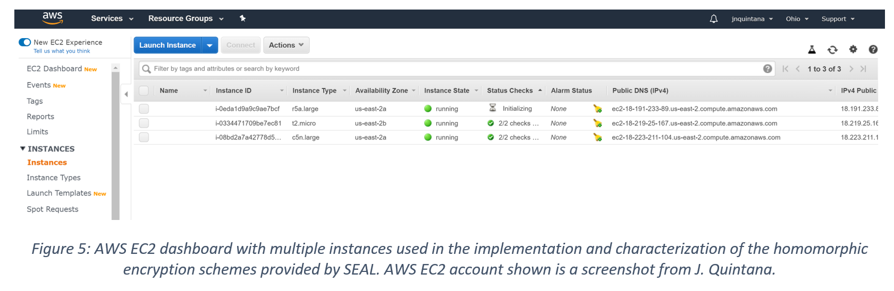

We instantiated the instances using an Ubuntu 18.04 server image and accessed them via SSH from our
local machines. We installed the SEAL libraries and performed all benchmarking via the SSH session.

#### 3.2.3 Client-Server Implementation

After benchmarking the performance both with the low SWaP embedded device in objective one and
the cloud computing service instances in objective two, we sought to improve the performance of the
homomorphic encryption library by distributing the computational requirements between a resource-
constrained client and a high-performance server. We added a series of options to the SEAL libraries and
used the c5n_large to test the client-server model, compared to the benchmarks obtained under
objective two. The added performance test options are shown in Figure 6.

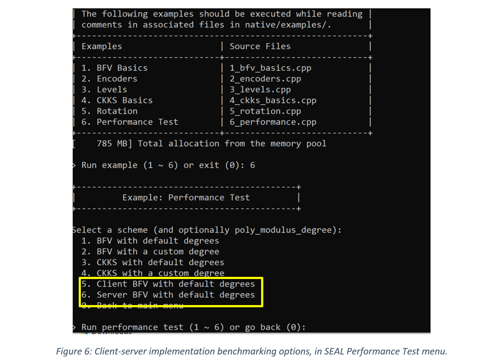

The client-server implementation had limited success over WiFi with the Raspberry Pi to AWS EC
instance, so much of the benchmarking was performed between AWS EC2 instances. Improvements on
this implementation are suggested in 5.0 Summary & Future Work.

## 4.0 Experiment Results

Metrics used to evaluated the performance of the different instantiations of the SEAL library and its
modified client-server model included average computation time for various functions computed during
the performance tests for different selected polynomial degrees. We also looked at CPU usage percent
using the basic Linux diagnostic tools, but this measurement, though averaged over multiple test cycles,
is crude and should not be used as a determination in our success criteria.

Performance metrics for objectives one and two were obtained by J. Quintana. Performance metrics for
objective three were obtained by D. Achee. All results were obtained using an SSH connection to each
platform. Any differences resulting from using two computers to obtain data were determined
negligible. D. Achee also obtained data for the AWS EC2 instances, which correlated with the averages
obtained by J. Quintana for the same instance type.

### 4.1 Low SWaP Results

The Raspberry Pi instantiation was able to successfully run all performance tests, with the exception of
those run for the polynomial degree option 32, 768 (2^15 ). The performance tests were run for both BFV
and CKKS encryption schemes provided in the SEAL library functions. The computation time in
milliseconds for each function instrumented is shown as a function of polynomial degree choice in Table
3 for the BFV encryption scheme implementation and in Table 4 for the CKKS encryption scheme
implementation.

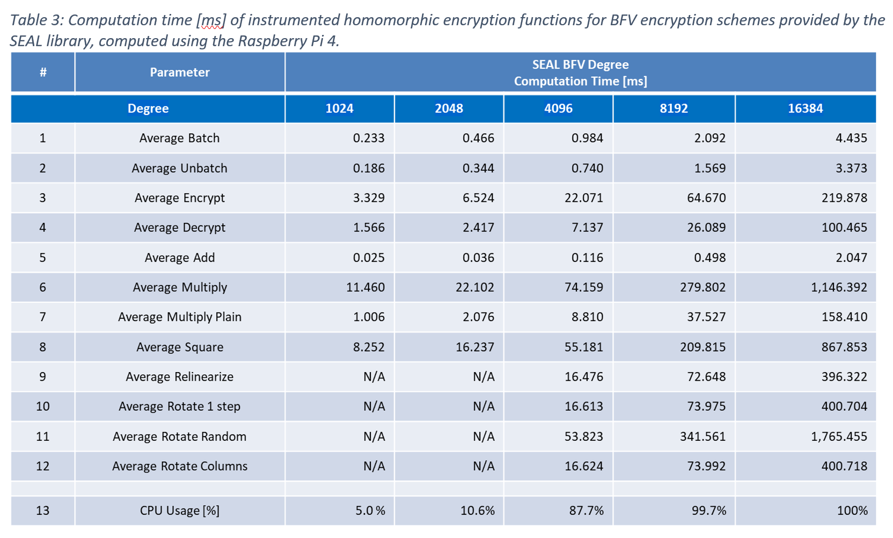

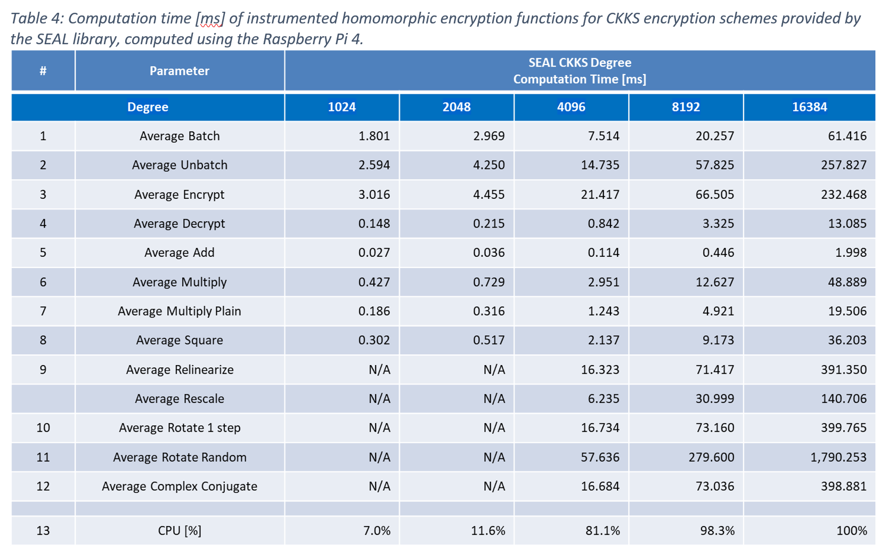

As we would expect, the Raspberry Pi 4 computation time increased exponentially with increasing
polynomial degree used. Note that for some low polynomial cases (1024 and 2048), some functions are
not computed.

For the functions add, multiply (ciphertext), multiply (plaintext), and square, the computation time for
the BFV and CKKS implementations are shown in Figure 7.

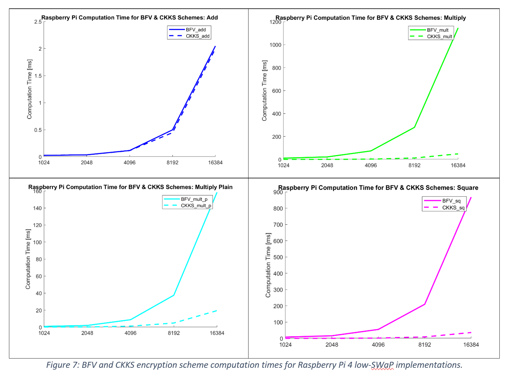

The BFV and CKKS computation time for the addition functions track closely to one another, but the
multiplication and squaring functions for CKKS complete with much less time than those equivalent
functions for BFV. The BFV functions used in the SEAL libraries use a tuple of the polynomial which
differs from the textbook implementation and may contribute to this difference. It should be noted that
the computation time for the ciphertext multiplication function (green) exceeds 1s in the BFV case,
which can cause unacceptable delays for computation on large volumes of data. These results provide
motivation for our attempts in objective three to reduce the computational costs on the client side.

### 4 .2 AWS EC2 Results

The AWS EC2 instances (t2_micro, c5n_large, r5a_large) have similar performance characteristics to one
another for both BFV and CKKS scheme implementations. A table of average computation results for all
three instances with both BFV and CKKS implementations are shown in Table 5 through Table 10.

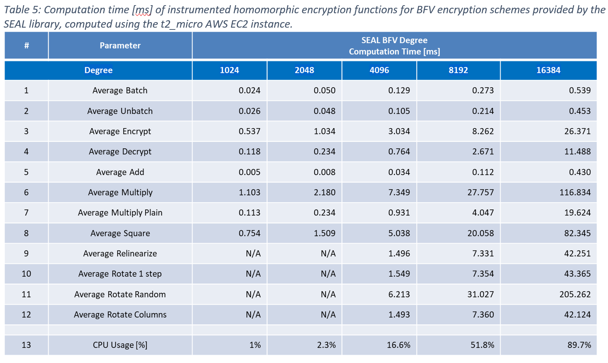

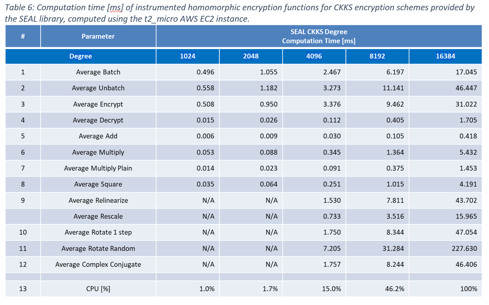

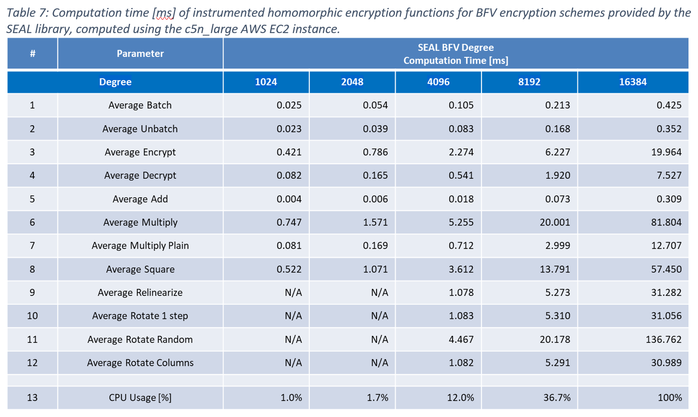

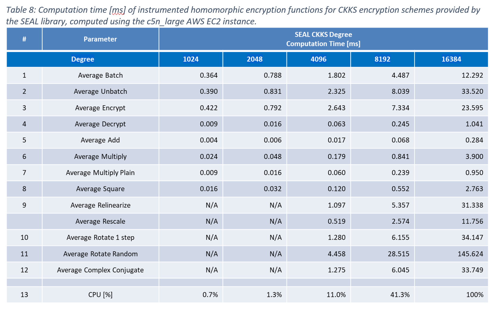

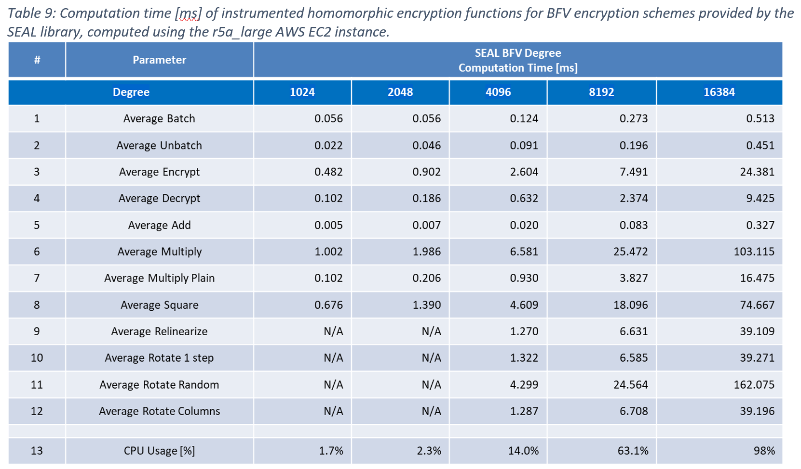

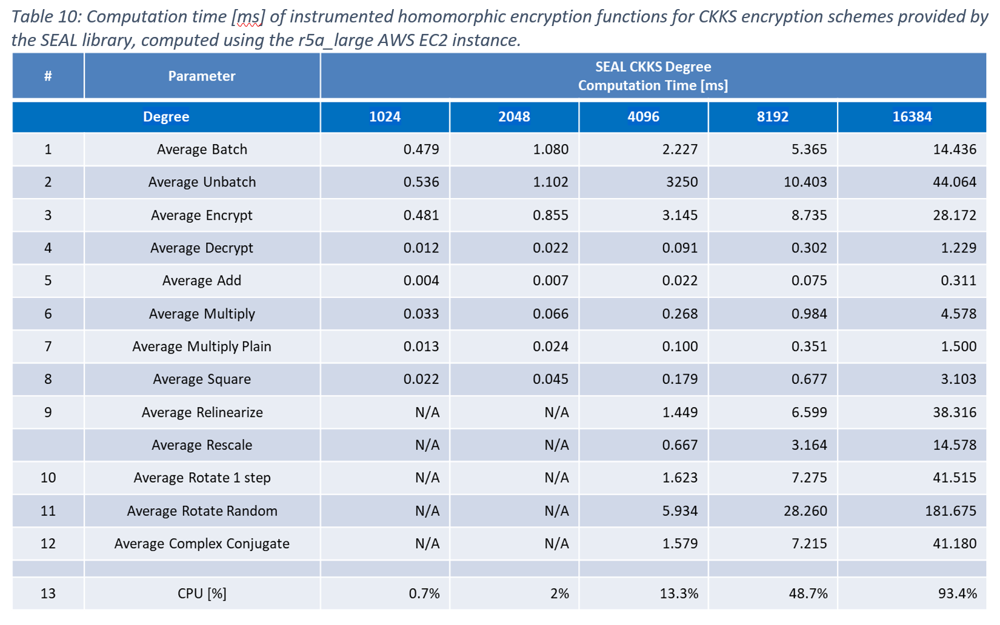

The add, multiply (ciphertext), multiply (plaintext), and square functions are compared for the t2_micro
resource-constrained instance, which is most comparable to a small SWaP platform, and the c5n_large
and r5a_large optimized instances. A graphical comparison of the results is shown in.

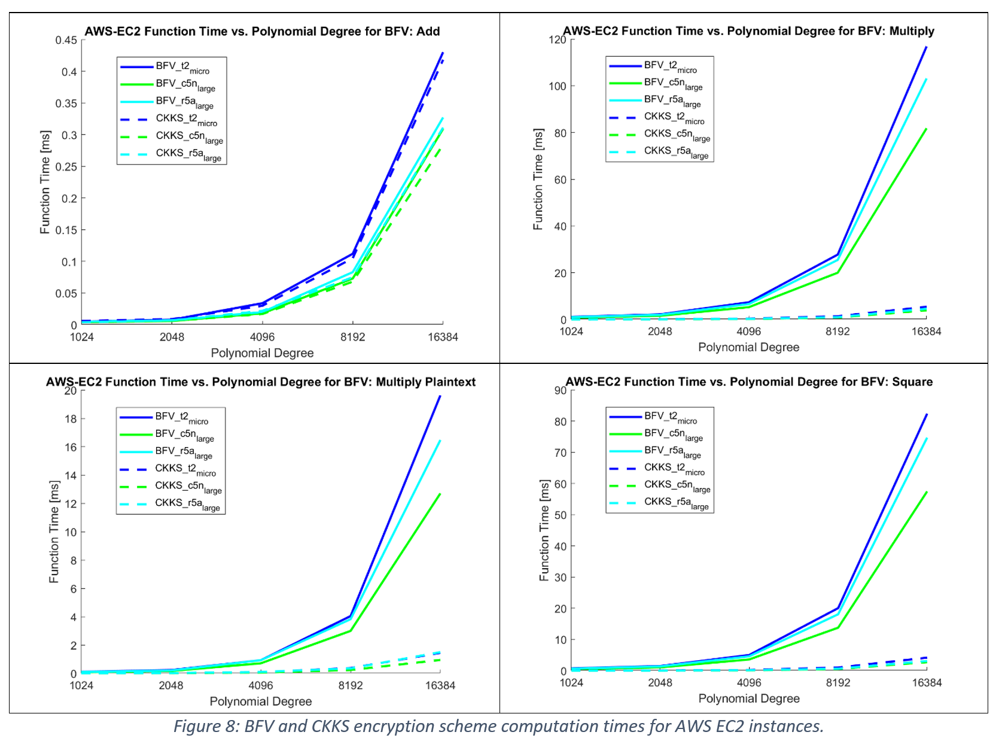

Similar to the low SWaP Raspberry Pi results, the AWS EC2 instances track well to one another for the
add function, but the CKKS implementation of multiply (ciphertext and plaintext) and square functions
are more computationally efficient than their BFV equivalents. Even though the t2_micro instance is
significantly more resource constrained than the high-performance optimized c5n_large and r5a_large
instances, their computation times are closely grouped.

The AWS EC2 instance computation times are overlaid with the Raspberry Pi 4 computation times from
objective 1. These are shown in Figure 9.

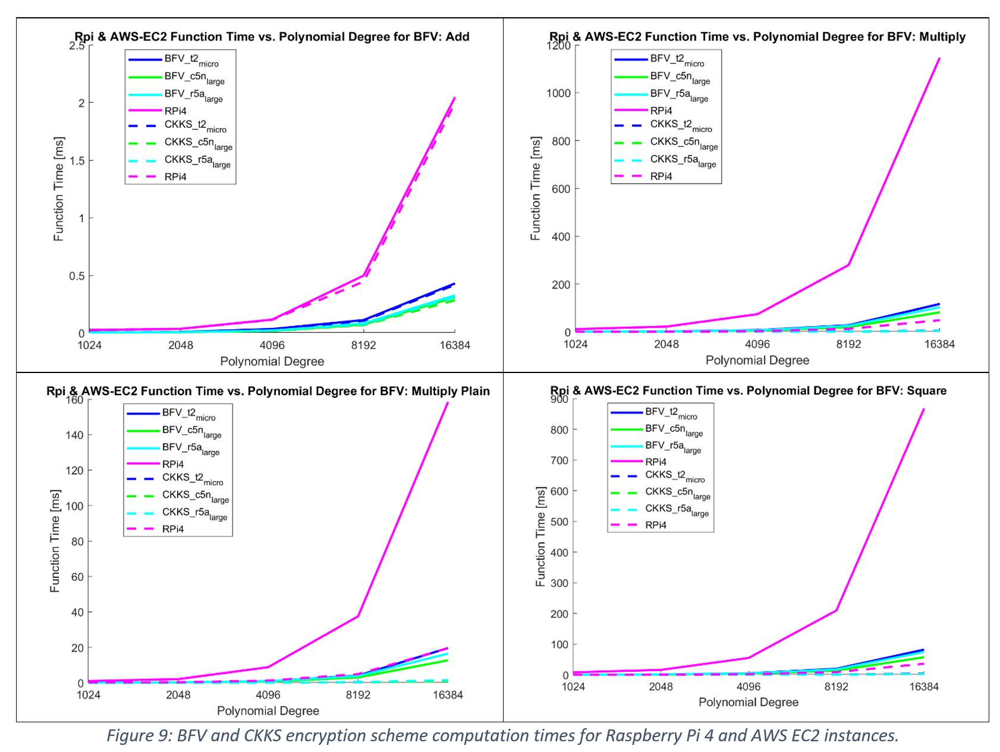

The Raspberry Pi’s implementation of the BFV encryption scheme, takes significantly longer for higher
polynomial degrees than the AWS EC2 instances for the equivalent computation. For the CKKS
implementation, the multiplication and square functions for both AWS EC2 and Raspberry Pi
implementations track closely to one another. For the add function, both the BFV and CKKS
implementations on the Raspberry Pi are more computationally costly than the equivalent computation
on the AWS EC2 instances.

Figure 9 ’s graphical comparison of the Raspberry Pi and AWS EC2 implementations helps to inform our
implementation of the client-server model. We postulate that we can improve the most by optimizing
the BFV scheme for the client-server model because the disparity in computation times between the
Raspberry Pi 4 and the high-performance AWS EC2 instances is greatest for the BFV scheme for all four
functions analyzed.

### 4 .3 Client-Server Implementation Results

The client server implementation was performed on the BFV encryption scheme, based on our analysis
from objective 2. A screenshot of the console view for the updated client-server computation is shown
in Figure 10.

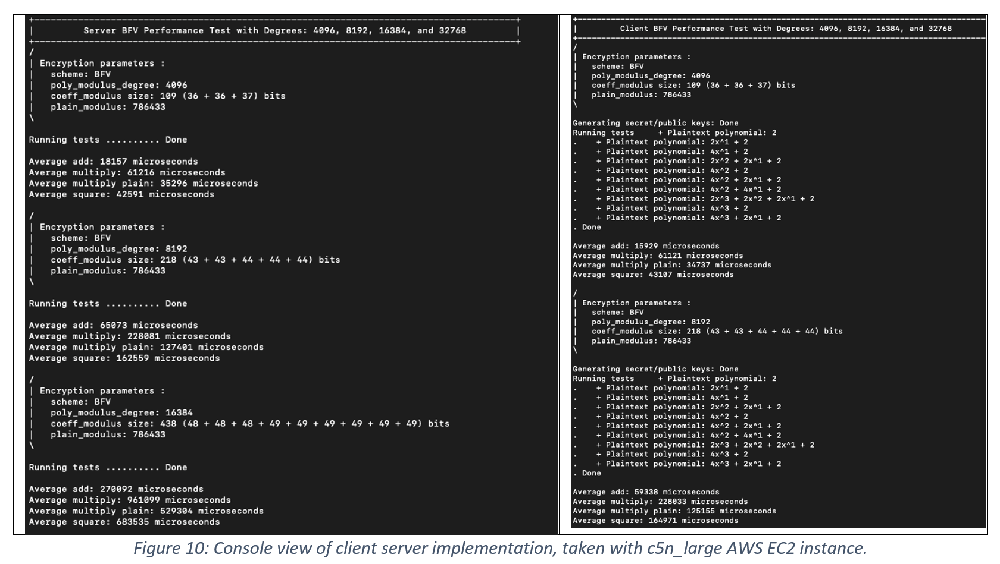

For the client-server implementation, the code was instrumented in the same manner for computation
time measurements. We included the network traffic time in this calculation because in terms of total
cost of the system, network traffic time must be considered when being compared to an entirely local
computation. Our results were different than expected, when compared to the baseline local
computation. We expected a similar trend in computation time versus polynomial degree, simply shifted
vertically to account for the distributed computation between the client and server. However, what we
saw was an increased computation time contribution from the sharing of information between client
and server, which was greater than the local computation time for low polynomial degree. We think the
contribution of the serialized and transmitted data exceeds the computational time for the function
itself. These results are shown in Figure 11.

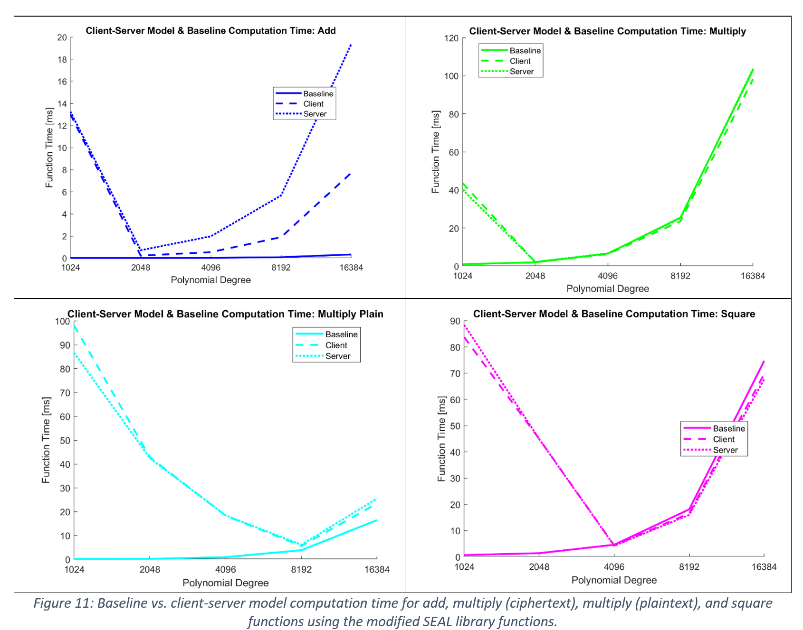

We conclude that the serialization and transmission of the data contributes to the total computation
time for each function in a manner than exceeds the benefit of distributing the computation between
platforms. Future work to improve the transfer of data between platforms may reduce this cost, so that
the client-server model yields improved results. The size of the object in bytes for each polynomial
degree is shown in Table 11.

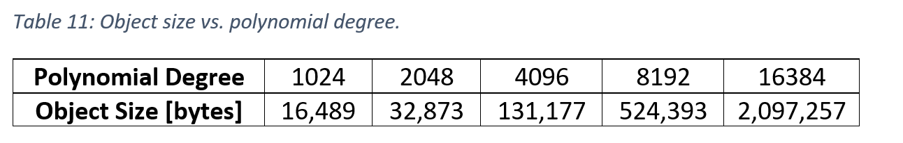

The client-server model unfortunately does not show improvement over the baseline local computation
method. Future work to optimize the SEAL library as well as a client-server model may in the future
make that model more feasible. However, at this time, it is not a viable alternate solution to the baseline
local computational model.

### 4.4 Related Work

Some groups have performed similar low SWaP analyses and implementations of homomorphic
encryption with the motivation to improve the security of IoT devices. One group performing related

work is led by A. Prasitsupparote from the Security Fundamentals Laboratory in Japan [9]. Their
experiment compared the HElib and SEAL libraries to implement a fully homomorphic encryption
scheme on a privacy preserving protocol for wearable devices in healthcare systems, shown in Figure 12
[9].

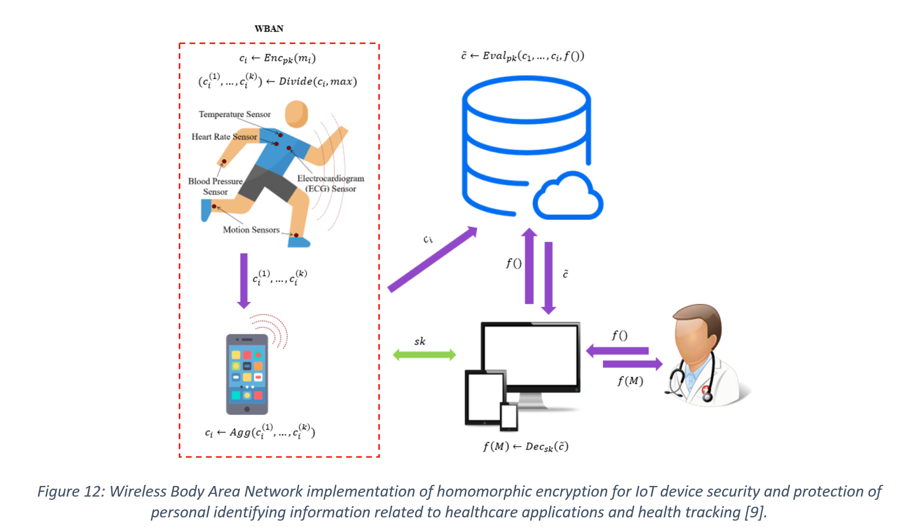

The implementation by this group was performed on a PC and a Raspberry Pi combination. The number
of homomorphic operations were limited by function, to account for the limited processing resources on
the Raspberry Pi [9]. They separated and measured the computation and communication costs using
OMNET++ and Castalia to compare the HElib and SEAL capabilities [9]. Computational delays were larger
for the SEAL library than HElib, but SEAL provided more homomorphic computational capabilities [9].
The implementation results for the Raspberry Pi computation times were comparable to our results. The
authors noted that delay times for this implementation was not practical for real-time bidirectional
communication [9].

In addition to research work, there are solicitations for solutions to cybersecurity problems that can
include homomorphic encryption. Broad Area Announcements (BAAs) for FY2020 – FY2 024 posted
include:

- Capabilities for Cyber Resiliency
- Foundations of Trusted Computational Information Systems
- Cyber Warfare Detachment

This is an active area of research, and with improved computational capability on embedded devices,
may provide a practical solution for data security.

## 5 .0 Summary & Future Work

Our experiment contained three objectives to investigate and characterize the implementation of a
homomorphic encryption scheme on a small SWaP platform, on a cloud computing service, and via a
client-server module, the latter used to investigate the potential gains of splitting the computation cost
between platforms. We determined that the BFV implementation using the Microsoft SEAL library was
more efficient on the AWS EC2 instances than on the Raspberry Pi, however, for all but the addition
function, the Raspberry Pi implementation was comparable to the AWS EC2 implementations. We
implemented a client-server model of the SEAL library and determined that when the computational
and communication times are analyzed together, the total computation cost exceeds that of the
equivalent computation performed on only the local instance.

Future work includes the optimization and improvement of the communication protocol between the
client and server as well as potential optimization of memory allocation of the SEAL library itself. The
advancement of computational capability in small SWaP devices has made homomorphic encryption a
possibility for wearable and other IoT or small embedded devices.

## 6 .0 References

[1] P.V. Parmar, et. Al., “Survey of Various Homomorphic Encryption Algorithms and Schemes”,
_International Journal of Computer Applications_ , (0975-8887), Vol. 81, No. 8, April 2014.

[2] C. Gentry, “Fully Homomorphic Encryption Using Ideal Lattices”, _Stanford University, IBM Watson_ ,
2009.

[3] K. Lauter, et. Al., “Can Homomorphic Encryption be Practical?” _Microsoft Research_ , _Eindhoven
University of Technology, University of Toronto_ , 2011.

[4] N. Downlin, et. Al., “Manual for Using Homomorphic Encryption for Bioinformatics”, _Microsoft
Research, Princeton University_ , accessed Jan 2020.

[5] Z. Brakerski and V. Vaikuntanathan, “Efficient Fully Homomorphic Encryption from (Standard) LWE”,
_SIAM Journal on Computing_ , Vol. 43, No. 2, 831-871, 2014.

[6] J. Howe, et. Al., “On Practical Discrete Gaussian Samplers for Lattice-Based Cryptography”, _IEEE
Transactions on Computers_ , Vol. 67, No. 3, March 2018.

[7] S. Fau, et. Al., “Towards practical program execution over fully homomorphic encryption schemes”,
_Eighth International Conference on P2P, Parallel, Grid, Cloud and Internet Computing_ , 2013.

[8] K. Laine, et. Al., “Simple Encrypted Arithmetic Library 2.3.1”, _Microsoft Research_ , 201 8.

[9] A. Prasitsupparote, et. Al., “Implementation and Analysis of Fully Homomorphic Encryption in
Wearable Devices”, _Proceedings of 4th International Conference on Information Security and Digital
Forensics, ISDF2018_ , Greece, 2018.

## 7 .0 Appendix A: Product & Application Links

DE10 Nano SoC Development Kit

https://www.amazon.com/Terasic-Technologies-P0496-DE10-Nano-
Kit/dp/B07B89YHSB/ref=sr_1_fkmr1_1?dchild=1&keywords=de10+nano+sock&qid=1584739601&sr=8-
1 - fkmr1

CanaKit Raspberry Pi 4 Starter Kit – 4GB RAM

https://www.amazon.com/CanaKit-Raspberry-4GB-Starter-
Kit/dp/B07V5JTMV9/ref=sr_1_3?dchild=1&keywords=raspberry+pi+4+canakit&qid=1584739700&sr=8- 3

Raspbian Image

https://www.raspberrypi.org/downloads/

## 8.0 Appendix B: Instructions to Run SEAL Library Implementation

### 8.1 Installing Microsoft SEAL

Follow the instructions on https://github.com/Microsoft/SEAL to download the source code and install
microsoft SEAL for your respective platform

### 8.2 Integrating Our Code

Let seal_location be the location of the SEAL library on your system

5.0 Download our github repo
6.0 $ cd client_server_performance_test
7.0 $ cp 6_performance.cpp seal_location/native/examples
8.0 $ cp examples.h seal_location/native/examples
9.0 $ cp examples.cpp seal_location/native/examples
10.0 $ cd seal_location/native/examples
11.0 $ make
12.0 $ cd ../bin

### 8.3 Running the Server Performance Test

It is important to always start the server before the client or else the client will report "Error connection
refused".

$ ./sealexamples [portnumber]

where portnumber is the port that you want to the server to use.

Then select option 6 from both the first and second menu. It will hang until you start the client test.

Running the Client Performance Test

$ ./sealexamples [hostname] [portnumber]

where hostname is the IP address or DNS name of the server and server is the port used by the server

Currently the implementation is most stable when both the client and server are run using the same
host. Therefore, please specify localhost as the hostname. Then select option 6 from the first menu and
option 5 from the second menu.

### 8.4 Running Other Performance Tests

$ ./sealexamples

To run any of the other 10 performance tests you don't need to any command line arguments. Please
select the respective test using the menu presented after starting the code.

## 9.0 Appendix C: List of Associated Files

README.txt
209AS_FinalPresentation.pptx
Client-Server Model Software Folder
Console Data Logs (text files)

https://github.com/daniel-achee/ece209-project.git

## 10.0 Project Timeline

- January 28th: Boards received from Amazon, initial firmware image compiled.
- February 4th: Generate preliminary design (unencrypted data sample run, metric data baseline
    established).
- February 18th: Midterm Presentation.
- February 20th: Received and Configured Raspberry Pi 4
- February 25th: Generate final design (contains both homomorphic encyrption analysis tools and
    plaintext tools). Obtain data on metrics for comparison (see next section)
- March 4th: Results comparison, generate final report
